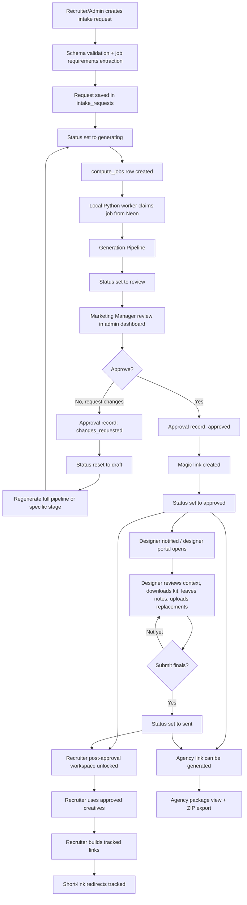
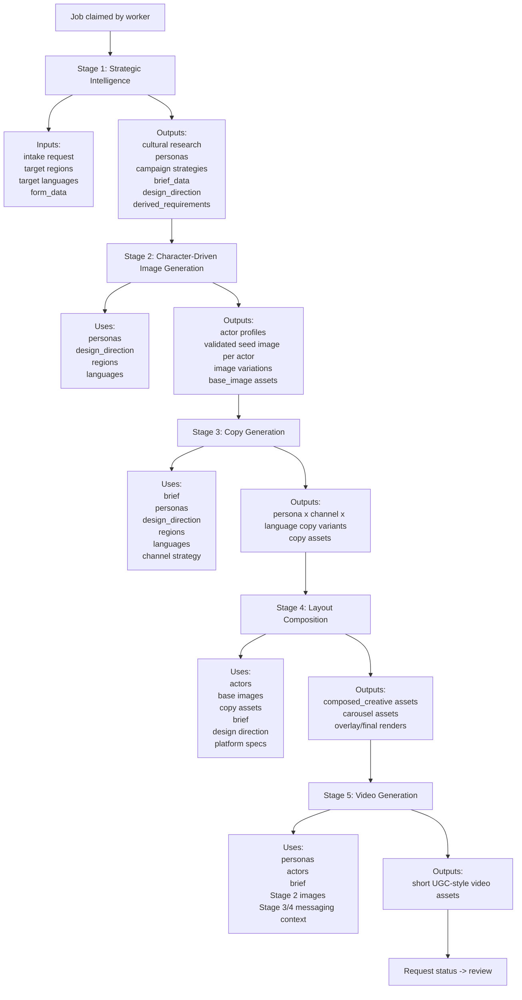

# Centric Intake Workflow Diagrams

## How To Read This Document

This document explains the workflow diagrams in plain language and includes the Mermaid source used to recreate the diagrams in tools that support Mermaid rendering.

The workflow is split into two views:

- End-to-end operating workflow: how a campaign moves from intake to review to handoff.
- Generation pipeline: how each AI generation stage feeds the next stage.

## End-To-End Operating Workflow

### Summary

The operating workflow starts with intake, moves through generation, pauses for marketing-manager review, and then unlocks designer, recruiter, and agency handoffs after approval.

### Reader-Friendly Flow

| Step | Owner | System Action | Result |
| --- | --- | --- | --- |
| 1 | Recruiter or Admin | Creates intake request. | Request enters the system. |
| 2 | Web App | Validates request and extracts structured fields. | Clean campaign data is saved. |
| 3 | Web App | Creates a compute job. | Worker has queued generation work. |
| 4 | Python Worker | Claims the job from the database. | Generation begins. |
| 5 | Python Worker | Runs the staged generation pipeline. | Strategy, personas, copy, images, creatives, and optional video are produced. |
| 6 | Web App | Moves request to review. | Marketing manager review is required. |
| 7 | Marketing Manager | Approves or requests changes. | Campaign either moves forward or returns for revision. |
| 8 | Designer | Reviews context, downloads kits, leaves notes, uploads finals. | Design handoff is completed. |
| 9 | Recruiter | Uses approved assets and creates tracked links. | Campaign activation begins. |
| 10 | Agency | Receives package view and export. | External handoff is packaged. |

### Mermaid Source

## Generation Pipeline

### Summary

The generation pipeline is intentionally staged. Each stage produces structured outputs that become the inputs for the next stage. This makes the system easier to reason about, review, retry, and improve over time.

### Stage Dependency Map

| Stage | Inputs | Outputs | Feeds |
| --- | --- | --- | --- |
| Stage 1: Strategic Intelligence | Intake request, regions, languages, form data. | Research, personas, campaign strategy, creative brief, design direction. | Stage 2, Stage 3, Stage 4. |
| Stage 2: Character-Driven Image Generation | Personas, design direction, regions, languages. | Actor profiles, seed images, image variations, base image assets. | Stage 3 and Stage 4. |
| Stage 3: Copy Generation | Brief, personas, design direction, channel strategy. | Persona, platform, and language-specific copy variants. | Stage 4. |
| Stage 4: Layout Composition | Actors, images, copy, brief, design direction, platform specs. | Composed creatives, overlays, carousel panels, final renders. | Stage 5 and review package. |
| Stage 5: Video Generation | Personas, actors, brief, images, messaging context. | Optional UGC-style video assets. | Final review package. |

### Mermaid Source

## Key Review Talking Points

- Intake creates the source campaign record.
- Compute jobs decouple web interactions from heavy AI work.
- Stage 1 is the strategy layer and should happen before visual generation.
- Stage 2 creates the visual identity layer.
- Stage 3 creates the messaging layer.
- Stage 4 combines strategy, visuals, and copy into usable creative outputs.
- Stage 5 extends the package into optional video.
- Marketing review is the quality gate before designer, recruiter, or agency handoff.

